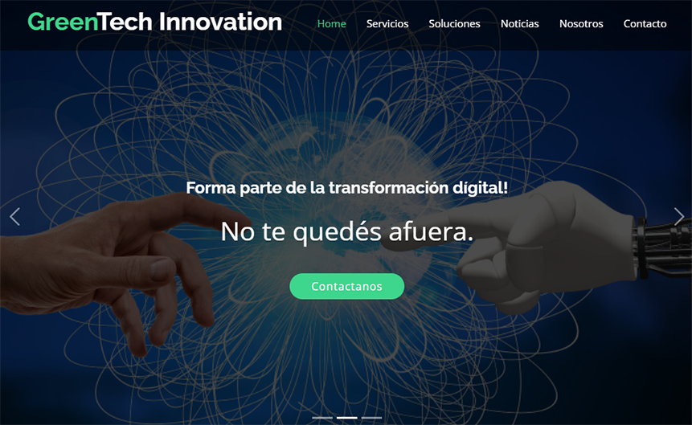
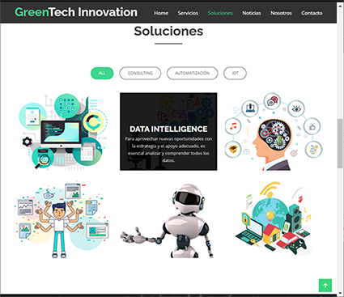
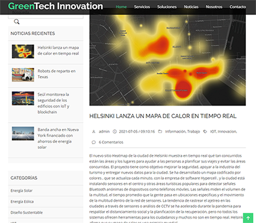
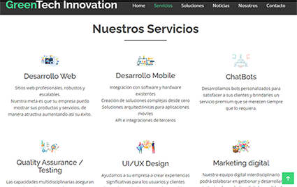

# Green Tech Innovation - Rediseño

Green Tech Innovation es una consultora de sistemas que brinda una amplia gama de servicios informáticos.

## Proyecto 

El proyecto consistió en analizar el sitio [Green Tech Innovation - Original - ](http://greentechinnov.net/) realizado en wordpress y generar un prototipo de rediseño del sitio web en bootstrap.

El resultado del rediseño se puede observar en  [Green Tech Innovation](https://elicasama.github.io/greentechinnov/)

## Desafíos

En el proceso aprendí

- Análisis de un sitio web existente 
- Modificaciones de templates en bootstrap
- Armado de formularios
- Diseño responsive

## Créditos

Muchas gracias al equipo de [Green Tech Innovation](http://greentechinnov.net/) por permitirme analizar su sitio.

El diseño se basó en el template de bootstrap con los créditos que se listan abajo.

=======================================================

- Template Name: eBusiness - v4.3.0
- Template URL: https://bootstrapmade.com/ebusiness-bootstrap-corporate-template/
- Author: BootstrapMade.com
- License: https://bootstrapmade.com/license/

## Screenshots

 
 

